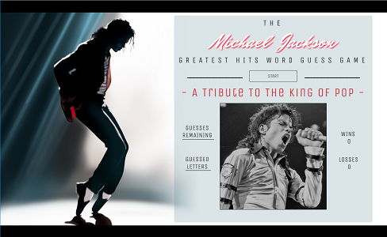
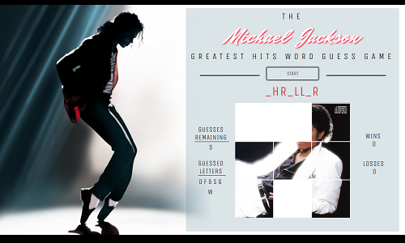

# The Michael Jackson Greatest Hits Word Guess Game

[Link to the App](https://lii41333733.github.io/word-guess-game/)

## Introduction

If you are a fan of the King of Pop, you will enjoy this app which presents you with 14 rounds of word guess action all tailored to Michael Jackson's Greatest Hits! The app features a mini-slideshow on the life of the superstar, album cover hints for incorrect guesses and a small visual surprise after each round that will speak to you from MJ himself. I hope this cures your Michael Jackson itch and if you enjoy the game, *Don't Stop 'Til You Get Enough!*

## Proof of Concept

The main functionality of the app is to display updating HTML and CSS dynamically by the power of JavaScript functions and user input. Through the development of the app, I was able to showcase how JavaScript can be used to have the DOM listen for user input and change based on what specific keys are entered by the user.

## Technologies Used
* HTML
* CSS
* JavaScript
* Bootstrap

## Screenshots

### At Game Start

### During Gameplay

